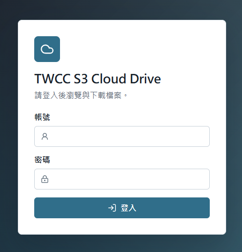

# TWCC S3 Cloud Drive

前後端分離的 S3-compatible 檔案瀏覽與下載系統。前端只呼叫 REST API；後端負責登入、讀取固定 bucket、產生短效下載連結。Access Key、Secret Key、bucket 設定都只存在部署主機的 `.env`，不會提交到 GitHub，也不會回傳給使用者。

## Interface Preview



## Features

- 多組帳號登入，密碼以 bcrypt hash 存在 `users.json`
- 類似雲端硬碟的資料夾瀏覽、breadcrumb、搜尋、檔案大小與修改時間
- 檔案預設依修改時間由新到舊排序
- 單檔下載，後端產生短效 presigned URL
- Docker Compose 部署，`frontend` 對外服務，`backend` 只在 compose 內部網路
- 支援 TWCC COS 或其他 S3-compatible endpoint

## Project Layout

```text
.
├── backend/            # Express REST API and S3 integration
├── frontend/           # React + Vite UI, served by Nginx
├── docker-compose.yml
├── .env.example
├── users.example.json
└── README.md
```

## Linux Deployment

1. 建立環境設定：

```bash
cp .env.example .env
```

2. 編輯 `.env`，填入主機專用的秘密值：

```env
SESSION_SECRET=replace-with-a-long-random-secret
S3_ENDPOINT=https://cos.twcc.ai
S3_BUCKET=your-bucket
S3_ROOT_PREFIX=uploads/
S3_REGION=us-east-1
S3_ACCESS_KEY_ID=your-access-key-id
S3_SECRET_ACCESS_KEY=your-secret-access-key
S3_FORCE_PATH_STYLE=true
SIGNED_URL_EXPIRES_SECONDS=300
FRONTEND_PORT=8080
USERS_FILE=/app/config/users.json
```

`S3_ROOT_PREFIX` 是所有登入帳號可瀏覽及下載的 S3 根路徑。設定為 `uploads/` 時，網頁根目錄只會顯示該資料夾內的內容；後端會拒絕範圍外或包含 `..` 的路徑。若要允許整個 bucket，請設定為空值：`S3_ROOT_PREFIX=`。

3. 建立第一個登入帳號：

```bash
cp users.example.json users.json
docker compose build backend
docker compose run --rm --no-deps \
  --volume "$(pwd)/users.json:/app/config/users.json:rw" \
  backend node dist/scripts/add-user.js \
  --username alice \
  --file /app/config/users.json
```

這會在專案根目錄建立或更新 `users.json`。`users.json` 只包含帳號與 bcrypt hash，已在 `.gitignore` 中排除。帳號管理工具直接在一次性 Docker 容器中執行，因此部署主機不需要另外安裝 Node.js、npm 或 pnpm。

4. 啟動服務：

```bash
docker compose up -d --build
```

5. 開啟：

```text
http://your-linux-host:8080
```

## Add More Users

在部署主機上執行：

```bash
docker compose run --rm --no-deps \
  --volume "$(pwd)/users.json:/app/config/users.json:rw" \
  backend node dist/scripts/add-user.js \
  --username bob \
  --file /app/config/users.json

docker compose restart backend
```

同名帳號會更新密碼；不同帳號會新增到同一份 `users.json`。第一版所有帳號擁有相同 bucket 瀏覽與下載權限。

Windows PowerShell 請使用以下寫法：

```powershell
docker compose run --rm --no-deps `
  --volume "${PWD}\users.json:/app/config/users.json:rw" `
  backend node dist/scripts/add-user.js `
  --username bob `
  --file /app/config/users.json

docker compose restart backend
```

指令會互動式要求輸入並確認密碼，輸入內容不會顯示在畫面上。正式執行中的 backend 仍以唯讀方式掛載 `users.json`；只有這個一次性管理容器會暫時使用可寫掛載。

## REST API

所有檔案相關 API 都需要登入 session。

```http
POST /api/v1/auth/login
POST /api/v1/auth/logout
GET  /api/v1/auth/me
GET  /api/v1/objects?prefix=&continuationToken=
POST /api/v1/download-urls
```

下載 API body：

```json
{
  "key": "folder/file.pdf"
}
```

回傳：

```json
{
  "url": "https://...",
  "expiresInSeconds": 300
}
```

使用者可能看見 S3 endpoint、bucket、object key 與短效簽名參數，但不會看見 Access Key 或 Secret Key。

## Local Development

此環境需要 Node.js 24 或相容版本與 pnpm。

```bash
pnpm install
pnpm dev:backend
pnpm dev:frontend
```

本機開發時前端 Vite 會把 `/api` proxy 到 `http://localhost:3000`。

## Validation

```bash
pnpm typecheck
pnpm test
pnpm build
```

Docker 驗證：

```bash
docker compose build
```

## GitHub Safety

請提交：

- source code
- `docker-compose.yml`
- `.env.example`
- `users.example.json`
- documentation

請不要提交：

- `.env`
- `users.json`
- 任何真實 Access Key / Secret Key
- 任何真實使用者密碼
