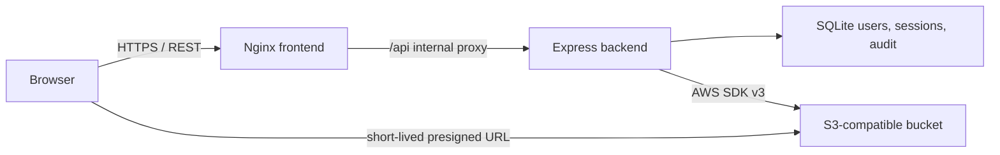

# Architecture

## Components

- Frontend：React、Vite、TypeScript；只知道目前使用者、相對檔案路徑及 presigned URL。
- Nginx：提供靜態檔、同源 `/api` proxy、來源 IP chain 與安全 response headers。
- Backend：Express REST API、Argon2id、Session、CSRF、RBAC、S3 scope 與稽核。
- SQLite：部署專屬的可持久化狀態；使用 WAL、foreign keys、busy timeout 及交易。
- S3：固定 endpoint/bucket/credential，每帳號僅變更允許的 prefix。

## Database Tables

| Table | Purpose |
| --- | --- |
| `schema_migrations` | 已套用的 schema version |
| `users` | username、Argon2id PHC、role、S3 prefix、管理備註 |
| `sessions` | server-side Session JSON、期限、user ID |
| `login_events` | 成功、失敗與限流登入 |
| `download_events` | 已簽發的 object download URL |
| `admin_events` | 帳號與權限管理操作 |

使用者外鍵刪除策略讓 Session cascade delete，但三種 audit table 使用 `SET NULL` 並保存 username snapshot。

## Request Lifecycle

1. Nginx 將 `/api` 傳給 compose 內部 backend。
2. Express 驗證 JSON、Session、CSRF 與 route authorization。
3. Auth middleware 依 Session user ID 重新查詢 SQLite，取得最新 role 與 prefix。
4. Object route 以 `ScopedStorage` 把相對路徑解析成實際 bucket key。
5. Backend 呼叫 S3 列檔或簽發 URL；SDK error 只轉成一般化代碼。
6. URL 簽發成功後寫入 download audit，瀏覽器再直接向 S3 下載。

## Migrations

Backend 啟動及 `db:init` 都會執行相同 migration runner。每個 migration 在 `BEGIN IMMEDIATE` 交易內完成，成功後寫入 `schema_migrations`。新版本只能新增下一個 version，不應修改已發布 migration。

- Version 1：帳號、Session 與三類稽核資料表。
- Version 2：為帳號新增 `note` 欄位；既有帳號以空字串初始化。

## Extension Points

- MFA/Passkey：在 Session 建立前增加第二階段驗證。
- External identity provider：以 OIDC identity 對應本機 role/prefix。
- Central audit：在 SQLite 寫入成功後送往外部不可變 log sink。
- Multiple backend replicas：把 SQLite Session/audit 換成共享式資料庫；目前設計預期單一 backend replica。
